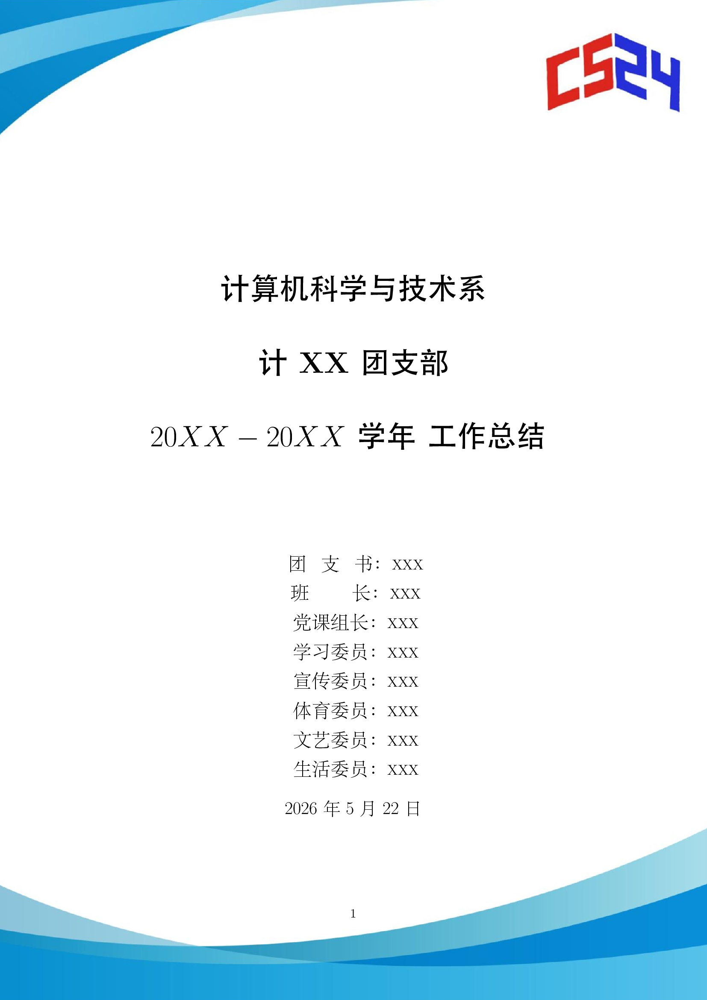
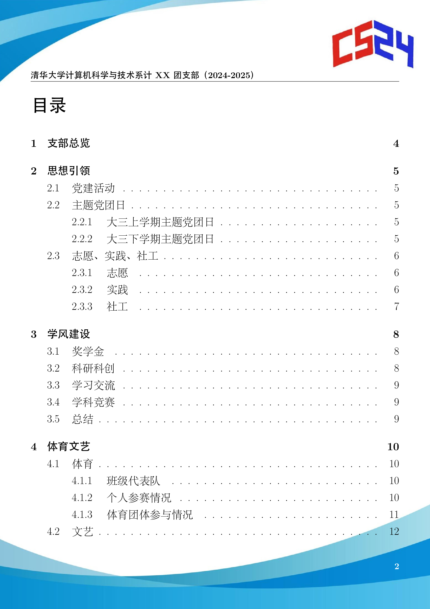
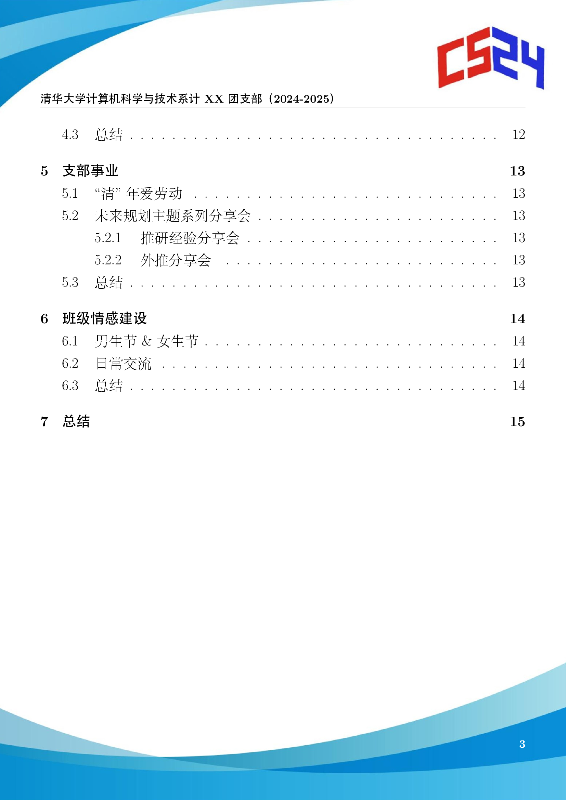
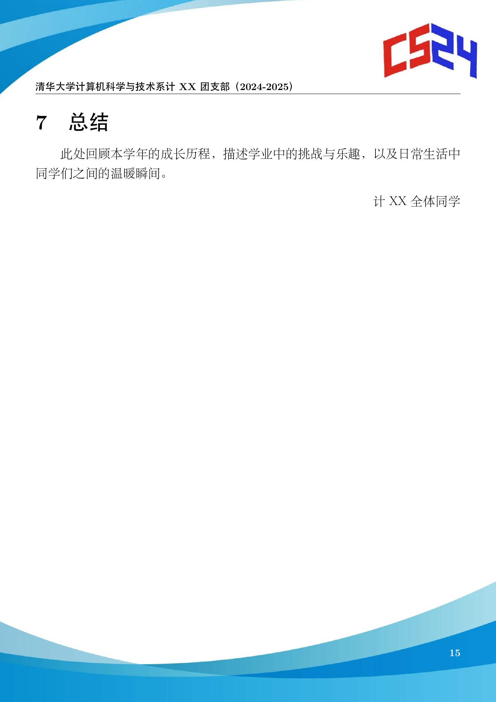

# Awesome Template for Grade-A Youth League Branch (THU)

清华大学甲级团支部工作总结 LaTeX 模板。

>   它也算一种“反内卷”：当所有人都用同一套高质量模板时，大家的起跑线就被整体抬高了，没必要再把时间浪费在重复排版上，而是能把精力更多放在内容本身。

## 效果预览

| 第一页 | 第二页 |
|:---:|:---:|
|  |  |
| 第三页 | 最后一页 |
|  |  |

## 文件结构

```
├── main.tex            # 主文件（标题页、目录、引入各章节）
├── reports.cls         # 自定义文档类（页面布局、页眉页脚、背景图）
├── overview.tex        # 第一章：支部总览
├── thoughts.tex        # 第二章：思想引领
├── studying.tex        # 第三章：学风建设
├── pe_and_art.tex      # 第四章：体育文艺
├── activity.tex        # 第五章：支部事业
├── connection.tex      # 第六章：班级情感建设
├── summary.tex         # 第七章：总结
├── assets/             # 图片资源
│   ├── background.jpg  # 页面背景
│   └── logo.png        # logo
└── backup/             # （参考）包含原始填写示例
```

## 使用方法

1. **Star 本仓库** ⭐
2. Clone 或下载本项目
3. 修改 `main.tex` 中的标题信息（班级名称、班委名单等）
4. 修改 `reports.cls` 中页眉的班级名称
5. 在各 `.tex` 文件中填入实际内容，替换 `XXX` 占位符
6. 将图片放入 `assets/` 目录，取消注释对应 figure 环境并修改路径
7. 编译 `main.tex`（推荐使用 `latexmk` 或 XeLaTeX）

## LICENSE

本项目采用 [Star License](LICENSE) —— 你可以自由使用、修改和分发本模板，但须遵守以下条件：

- **使用前请先 Star 本仓库** ⭐
- **修改或再分发时必须注明本仓库链接**
